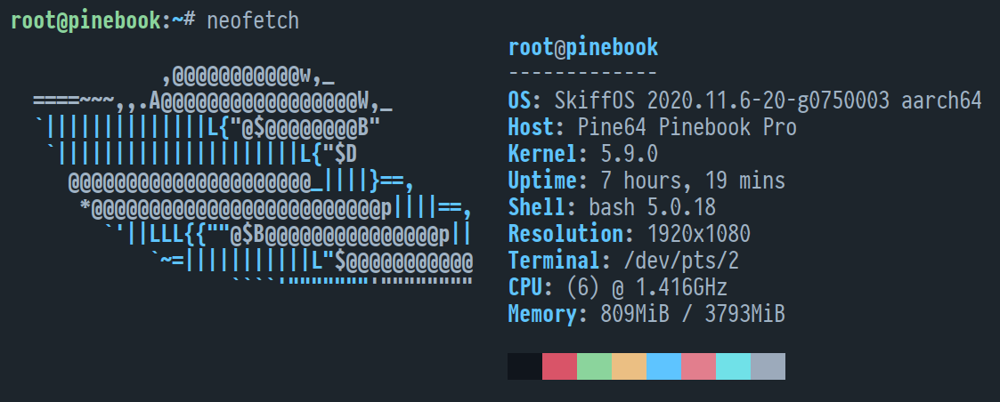

# Pine64 PineBook



This configuration package `pine64/book` compiles a Skiff base operating system
for the Pine64 PineBook.

References: 

 - https://linux-sunxi.org/Pine_Pinebook
 - https://wiki.pine64.org/index.php/Pinebook
 - https://wiki.pine64.org/index.php/Pinebook_Pro
 - https://github.com/samueldr/wip-pinebook-pro

## Getting Started

Set the comma-separated `SKIFF_CONFIG` variable:

```sh
$ export SKIFF_CONFIG=pine64/book,core/nixos_xfce
$ make configure                   # configure the system
$ make compile                     # build the system
```

Once the build is complete, it's time to flash the system. There are several
approaches, please see the "Flashing" section in the [common readme].

[common readme]: ../

Note: the PineBook will, on default, boot from the internal emmc with higher
priority than the MicroSD card.

Skiff's u-boot with adjusted boot priority can be flashed to the emmc from a
running pinebook system using two files from the images dir:

```sh
dd if=idbloader.img of=/dev/mmcblk0 seek=64 oflag=dsync,notrunc
dd if=u-boot.itb of=/dev/mmcblk0 seek=16384 oflag=dsync,notrunc
```

This will allow the system to boot from the SD card with higher priority than
the internal emmc, if found containing a valid u-boot flash.

## XFCE

Add `core/nixos_xfce` to SKIFF_CONFIG to enable "Skiff Core" with XFCE Desktop
configured.

## Known Issues

The PineBook Pro is a work in progress and the firmware / software does not
currently support everything perfectly (upstream issues):

 - Suspend does not work (firmware issue)
 - U-boot 2020.10 has LCD issues (for some units only)
   - Display is blurred + illegible on this version
   - Skiff is using 2020.07 for now

